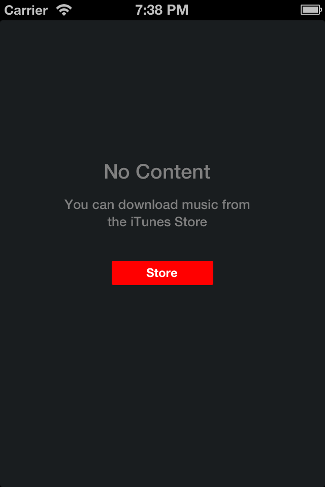

OBAlertView
===========

Full screen alert views aspired from iOS 7 music app. This control is based on ALFullScreenAlert by andrealufino

Screenshot
=================

Usage
=================

This is an example :

    OBAlert *alert = [[OBAlert alloc] initInViewController:self];
    [alert showAlertWithText:@"You can download music from the iTunes Store" 
   				   titleText:@"No Content" 
    			  buttonText:@"Store" 
    				   onTap:^{
        [alert removeAlert];
    }];